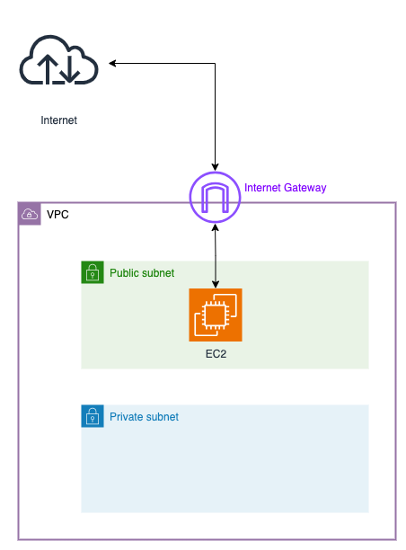
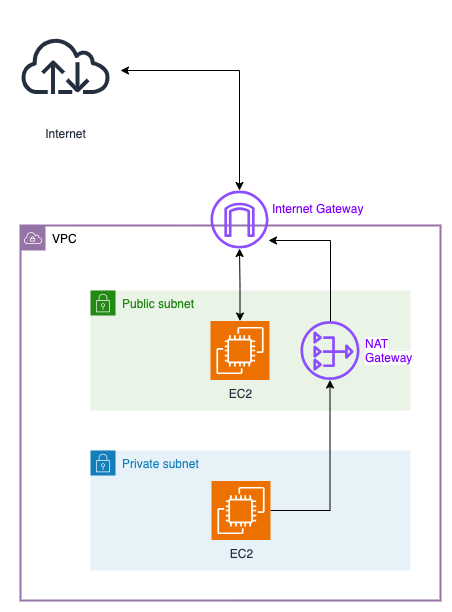

# Terraform Project Workspace Structuring Information:
## **versions.tf** : 
Keeps Terraform and Provider versions/source information separate from infrastructure logic. For example:
```
terraform {
  required_providers {
    aws = {
      source  = "hashicorp/aws"
      version = "~> 4.16"
    }
  }
  required_version = ">= 1.2.0"
}
```

## **providers.tf** : 
Keeps provider configs/settings separate, allowing multiple providers if needed. For example:
```
provider "aws" {
  region  = var.aws_region
  profile = var.aws_profile
}
```

If required we can even add the same provider multiple times with different alias and configs. For example:
```
provider "aws" {
  region  = "us-east-1"

  # This is optional since "default" is used by default
  profile = "default"
}

provider "aws" {
  alias   = "dev"
  region  = "us-east-1"

  # Uses the "dev" profile account details from ~/.aws/credentials file
  profile = "dev"  
}
```

### Commands For Configuring AWS Profiles:
Using profiles we can connect various AWS accounts from the same CLI.

```shell
# Command to configure a default profile
$ aws configure
    AWS Access Key ID [None]: **************
    AWS Secret Access Key [None]: ************************
    Default region name [None]: us-east-1
    Default output format [None]: json

# Command to configure a profile name sriram
$ aws configure --profile sriram
    AWS Access Key ID [None]: **************
    AWS Secret Access Key [None]: ************************
    Default region name [None]: us-east-1
    Default output format [None]: table

# These aws configure commands creates the following files:
```shell
$ ls -l ~/.aws/
total 16
-rw-------  1 sriramponangi  staff   95 15 Mar 15:36 config
-rw-------  1 sriramponangi  staff  232 15 Mar 15:30 credentials


$ cat ~/.aws/config 
[profile sriram]
region = us-east-1
output = json

[default]
region = us-east-2
output = yaml

$ cat ~/.aws/credentials 
[sriram]
aws_access_key_id = **************
aws_secret_access_key = ************************

[default]
aws_access_key_id = **************
aws_secret_access_key = ************************
```

If we want to use another profile instead of the default profile then:

**Approach-1**: Append the --profile [profile-name] flag to the aws command. For example:
```
$ aws s3 ls --profile default
$ aws s3 ls --profile sriram
```
**Approach-2**: Set the environment variable AWS_PROFILE. For example:
```
$ env | grep AWS
AWS_PROFILE=sriram
```

### Example of using same provider with different alias:
If `providers.tf` contains:
```
provider "aws" {
  region  = "us-east-1"
  profile = "account1"
}

provider "aws" {
  alias   = "account2"
  region  = "us-east-1"
  profile = "account2"
}
```
Then the two aws accounts/profiles can be used for creating resources in two AWS accounts like:
```
resource "aws_s3_bucket" "account1_bucket" {
  bucket   = "account1-bucket"
  provider = aws
}

resource "aws_s3_bucket" "account2_bucket" {
  bucket   = "account2-bucket"
  provider = aws.account2
}
```


## **variables.tf** : 
Centralizes configurable input variable values like region, profile, resource names, etc. For example:

```
variable "aws_region" {
  description = "AWS region"
  type        = string
  default     = "us-east-1"
}

variable "aws_profile" {
  description = "AWS credentials profile"
  type        = string
  default     = "default"
}
```

These variables can be used in other block like:
```
provider "aws" {
  region  = var.aws_region
  profile = var.aws_profile
}
```

## main.tf :
Focuses on infrastructure without cluttering version and provider details. For example:
```
resource "aws_s3_bucket" "my_bucket" {
  bucket = "my-unique-bucket-name"
  acl    = "private"
}
```


## outputs.tf :
Defines outputs that can be used by other modules or displayed in CLI. For example:
```
output "s3_bucket_name" {
  value = aws_s3_bucket.my_bucket.id
}
```


## Reusability: Using Modules
For better reusability across projects, you can create modules and call them from different environments.
You can create a module as a separate git repository remotely or just as a different local folder with `.tf` files.
For example, using a remote module and a local module where the input of one module is coming from the output of another module.

***main.tf***

```
# Module 1: VPC (Local Module)
module "vpc" {
  source = "./modules/vpc" # Path to the local module directory
  cidr_block = "10.0.0.0/16"
  enable_dns_support = true
  tags = {
    Name = "example-vpc"
  }
}

# Module 2: Subnets (Remote Module)
module "subnets" {
  source = "github.com/terraform-aws-modules/terraform-aws-subnet.git" # Remote module source
  version = "v1.0.0" # Specify version
  vpc_id = module.vpc.vpc_id # Input from the output of the VPC module
  cidr_blocks = ["10.0.1.0/24", "10.0.2.0/24"] # Example CIDR blocks for subnets
  tags = {
    Name = "example-subnets"
  }
}


```


## Terraform versioning syntax examples:

| **Operator**  | **Example**         | **Allowed Versions** | **Not Allowed** | **Behavior** |
|--------------|-------------------|----------------------|-----------------|--------------|
| `=`          | `= 4.16.0`        | **Only** `4.16.0`   | `4.16.1`, `4.17.0`, `5.0.0` | Locks to an exact version. No upgrades allowed. |
| `!=`         | `!= 4.16.0`       | **Anything except** `4.16.0` | `4.16.0` | Excludes a specific version. |
| `>`          | `> 4.16.0`        | `4.16.1`, `4.17.0`, `5.0.0` | `4.16.0` and below | Allows only versions greater than the specified one. |
| `<`          | `< 4.16.0`        | `4.15.9`, `4.15.8`, etc. | `4.16.0` and above | Allows only versions lower than the specified one. |
| `>=`         | `>= 4.16.0`       | `4.16.0`, `4.16.1`, `4.17.0`, `5.0.0` | `4.15.x` and below | Allows any version equal to or greater than the specified one. |
| `<=`         | `<= 4.16.0`       | `4.16.0`, `4.15.9`, `3.x.x` | `4.16.1` and above | Allows any version equal to or lower than the specified one. |
| `~>`         | `~> 4.16.2`       | `4.16.2`, `4.16.3`, `4.16.99` | `4.17.0+`, `5.0.0` | Allows **only patch updates**, but prevents minor and major upgrades. |
| `>= , <`     | `>= 4.16, < 5.0.0` | Same as `~> 4.16` | Same as `~> 4.16` | Equivalent to `~> 4.16`, allows upgrades within `4.x` but **blocks `5.0.0+`**. |


---
# AWS Networking Overview:

Overview of key AWS networking components.

## Virtual Private Cloud (VPC)
A **VPC (Virtual Private Cloud)** is an isolated virtual network within the AWS cloud where you can launch and manage AWS resources. It provides complete control over network configuration, including:
- IP address ranges
- Subnets
- Route tables
- Gateways

By default, AWS provides a pre-configured VPC with internet access, but you can also create custom VPCs tailored to your specific requirements.

## Subnets
Within a VPC, subnets are created to segment the network. They can be classified as:
- **Public Subnets**: Resources in these subnets can directly communicate with the internet, typically through an Internet Gateway (IGW).
- **Private Subnets**: Resources here are isolated from direct internet access, preventing unsolicited inbound traffic and enhancing security.


> **NOTE:** By default resources in one VPC cannot access resources in another VPC, but it can be enabled using NAT Gateways.

## Internet Gateway (IGW)
An **Internet Gateway (IGW)** allows communication between instances in a VPC and the internet. It:
- Enables public-facing resources to send and receive traffic from the internet.
- Is horizontally scaled, redundant, and highly available.
- Can only be attached to a single VPC at a time.




## NAT Gateway
A **Network Address Translation (NAT) Gateway** enables instances in private subnets to initiate outbound IPv4 traffic to the internet while preventing unsolicited inbound traffic. This is useful for:
- Downloading software updates
- Accessing external APIs securely without exposing instances to direct internet access



## Route Tables
**Route tables** contain a set of rules, called **routes**, that determine where network traffic is directed. Key points:
- Each subnet must be associated with a route table.
- Route tables control traffic routing for a subnet.
- Example: A public subnet route table directs internet-bound traffic to an IGW.

## Network Access Control Lists (NACLs)
A **Network ACL (NACL)** is a firewall that controls traffic in and out of one or more subnets. It:
- Provides an additional layer of security at the subnet level.
- Contains a numbered list of rules evaluated in order.
- Can allow or deny traffic based on IP ranges and protocols.

## Security Groups
**Security Groups** are virtual firewalls that control inbound and outbound traffic for AWS resources such as EC2 instances. Key points:
- Operate at the instance level.
- Specify allowed protocols, ports, and source/destination IP ranges.
- By default, deny all inbound traffic and allow all outbound traffic.

## VPC Endpoints
**VPC Endpoints** enable private connections between a VPC and supported AWS services without requiring:
- An Internet Gateway (IGW)
- A NAT device
- A VPN connection
- AWS Direct Connect

Traffic between the VPC and AWS services remains within the AWS network, improving security and reducing latency.

---

### Conclusion
Understanding and configuring these components effectively allows for designing robust, secure, and efficient network architectures within AWS.

