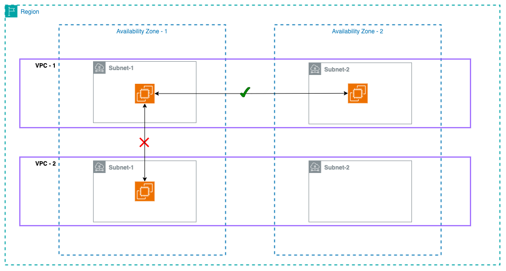
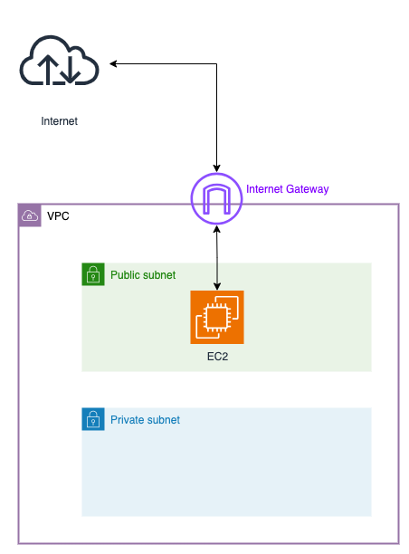
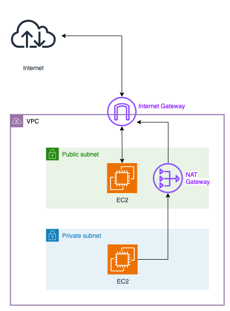
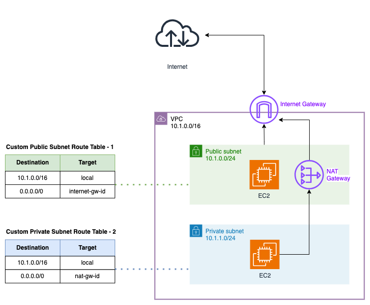
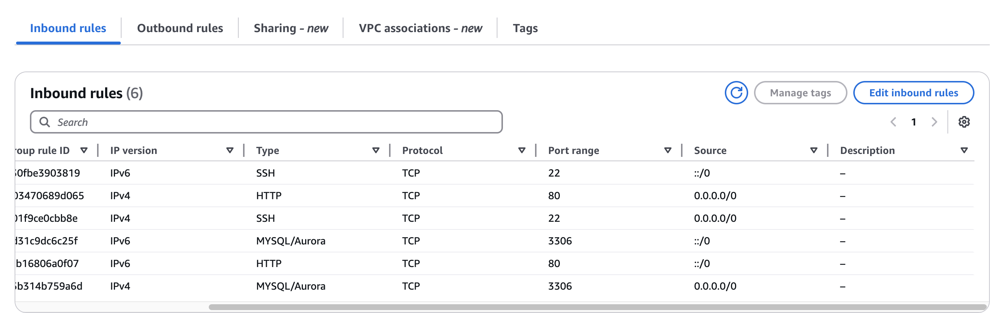

# AWS Networking Overview:
This section provides overview of key AWS networking components.


## Virtual Private Cloud (VPC)
A **VPC (Virtual Private Cloud)** is an isolated virtual network within the AWS cloud where you can launch and manage AWS resources. It provides complete control over network configuration, including:
- IP address ranges
- Subnets
- Route tables
- Gateways

By default, AWS provides a pre-configured VPC with internet access, but you can also create custom VPCs tailored to your specific requirements.

## Subnets
Within a VPC, subnets are created to segment the network. They can be classified as:
- **Public Subnets**: Resources in these subnets can directly communicate with the internet, typically through an Internet Gateway (IGW).
- **Private Subnets**: Resources here are isolated from direct internet access, preventing unsolicited inbound traffic and enhancing security.

> [!NOTE]  
> By default resources in one VPC cannot access resources in another VPC, but it can be enabled using NAT Gateways.



> [!TIP] 
> ### RFC 1918 Private IPv4 Address Recommendations:
> - RFC 1918 defines the ranges of IPv4 addresses reserved for private > networks, meaning these addresses are not routable on the > public internet and > are recommended for use within internal/private networks, like home or office > networks / AWS-VPCs. 
> - RFC 1918 defines three private IP address CIDR ranges:
> 
> | Address Range                | CIDR Notation | Number of IPs  | Best Use > Case          |
> |------------------------------|--------------|---------------| ------------------------|
> | 10.0.0.0 – 10.255.255.255    | **10.0.0.0/8**       | **16M+**      | > Large Enterprises      |
> | 172.16.0.0 – 172.31.255.255  | **172.16.0.0/12**      | **1M+**       | > Medium-sized Networks  |
> | 192.168.0.0 – 192.168.255.255| **192.168.0.0/16**      | **65K+**      | > Home & Small Offices   |
> 
> #### **Key Recommendations & Rules**  
> - **Use private IPs for internal networks** (home, office, enterprise > networks)  
> - **Do not use these IPs on the public internet** (ISPs block them)  
> - **NAT (Network Address Translation) is needed** to connect private networks > to the internet  
> - **These addresses can be reused** by different organizations without > conflicts  
> - **Private IPs help conserve IPv4 space**, reducing the need for public IPs


> [!TIP] 
> ### CIDR Basic Overview:
> CIDR, or Classless Inter-Domain Routing, is a method used to allocate IP > addresses and route Internet Protocol (IP) packets more efficiently. 
> 
> CIDR Notation Explanation:
> - Suppose we have the CIDR notation: 192.168.1.0/24.
> - Range of IPs available: 192.168.1.0 - 192.168.1.255 (Total Count: 256)
> - /24 indicates that the first 24 bits out of 32 bits in the IPV4 address are > fixed for the network prefix, and only the 8 bits are available for our > custom host addresses.
> - Decimal and binary representation of the IPV4:
>   ```
>   IP Address (Decimal): 192.168.1.0
>   IP Address (Binary): 11000000.10101000.00000001.00000000
>   ```
>   - The first 24 bits (`11000000.10101000.00000001`) are the fixed bits of > network prefix.
>   - The last 8 bits (`00000000`) are for the host portion, which can be > modified to create various IPV4 addresses under the 192.168.1.0/24 CIDR > notation.


> [!IMPORTANT] 
> ### Reserved IPs in a VPC Subnet
> AWS reserves 5 IP addresses within each subnet in the CIDR block. These reserved IPs serve specific purposes:
> 
> - **First IP Address (Network Address)**:
> Example: 192.168.1.0 in a 192.168.1.0/24 subnet.
> Reserved as the network address and used to identify the subnet itself.
>
> - **Second IP Address (VPC Router)**:
> Example: 192.168.1.1 in a 192.168.1.0/24 subnet.
> Reserved for the VPC router, which handles communication between subnets within the VPC and outbound traffic from the VPC to external networks (e.g., the internet or > a VPN).
>
> - **Third IP Address (Reserved for Future Use)**:
> Example: 192.168.1.2 in a 192.168.1.0/24 subnet.
> Reserved by AWS for potential future use.
>
> - **Fourth IP Address (DNS Server)**:
> Example: 192.168.1.3 in a 192.168.1.0/24 subnet.
> Reserved for the Amazon-provided DNS server, which enables DNS resolution for resources in the VPC.
> 
> - **Last IP Address (Broadcast Address)**:
> Example: 192.168.1.255 in a 192.168.1.0/24 subnet.
> Reserved as the broadcast address in the subnet. Although AWS doesn’t support broadcast in a VPC, this IP is still reserved.


## Internet Gateway (IGW)
An **Internet Gateway (IGW)** allows communication between instances in a VPC and the internet. It:
- Enables public-facing resources to send and receive traffic from the internet.
- Is horizontally scaled, redundant, and highly available.
- Only a single IGW can be attached to a VPC at a time.

  


## NAT Gateway
A **Network Address Translation (NAT) Gateway** enables instances in private subnets to initiate **outbound** IPv4 traffic to the internet while preventing unsolicited inbound traffic. This is useful for:
- Downloading software updates
- Accessing external APIs securely without exposing instances to direct internet access

  

## Route Tables
**Route tables** contain a set of rules, called **routes**, that determine where network traffic is directed within a VPC. Key points:
- It operates at the subnet level, where each subnet is associated with a single route table, but a route table can be shared across multiple subnets.
- Route tables manage the routing of traffic for a subnet, determining where outbound and inbound traffic is directed (e.g., to an Internet Gateway, NAT Gateway, or a local destination).
- Example: A public subnet's route table directs internet-bound traffic to an Internet Gateway, while a private subnet's route table routes outbound internet traffic through a NAT Gateway.

  

## Network Access Control Lists (NACLs)
A **Network ACL (NACL)** is a **stateless firewall** that controls traffic in and out of one or more subnets.
- The N-ACL firewall rules provides an additional layer of security at the subnet level.
- It contains a numbered list of rules evaluated in order from top to bottom.
- It can allow or deny traffic based on IP ranges, port ranges and protocols.

- Example of default inbound and outbound NACL Tables:

  > Default Inbound Rules Table

  | Rule # | Type       | Protocol | Port Range | Source         | Allow/Deny | Description                          |
  |--------|------------|----------|------------|----------------|------------|--------------------------------------|
  | 100    | All Traffic| All      | All        | 0.0.0.0/0      | ALLOW      | Allows all inbound traffic from any source. |
  | *      | All Traffic| All      | All        | 0.0.0.0/0      | DENY       | Denies all other inbound traffic by default. |


  > Default Outbound Rules Table

  | Rule # | Type       | Protocol | Port Range | Destination     | Allow/Deny | Description                          |
  |--------|------------|----------|------------|-----------------|------------|--------------------------------------|
  | 100    | All Traffic| All      | All        | 0.0.0.0/0       | ALLOW      | Allows all outbound traffic to any destination. |
  | *      | All Traffic| All      | All        | 0.0.0.0/0       | DENY       | Denies all other outbound traffic by default. |


- Example of a custom inbound and outbound NACL Tables:

  > Inbound Rules Table

  | Rule # | Type       | Protocol | Port Range | Source         | Allow/Deny | Description                          |
  |--------|------------|----------|------------|----------------|------------|--------------------------------------|
  | 100    | HTTP       | TCP      | 80         | 0.0.0.0/0      | ALLOW      | Allows inbound HTTP traffic from any IPv4 address. |
  | 110    | HTTPS      | TCP      | 443        | 0.0.0.0/0      | ALLOW      | Allows inbound HTTPS traffic from any IPv4 address. |
  | 120    | SSH        | TCP      | 22         | 192.168.1.0/24 | ALLOW      | Allows inbound SSH traffic from a specific subnet. |
  | *      | All Traffic| All      | All        | 0.0.0.0/0      | DENY       | Denies all other inbound traffic.    |

  > Outbound Rules Table

  | Rule # | Type       | Protocol | Port Range | Destination     | Allow/Deny | Description                          |
  |--------|------------|----------|------------|-----------------|------------|--------------------------------------|
  | 100    | HTTP       | TCP      | 80         | 0.0.0.0/0       | ALLOW      | Allows outbound HTTP traffic to any IPv4 address. |
  | 110    | HTTPS      | TCP      | 443        | 0.0.0.0/0       | ALLOW      | Allows outbound HTTPS traffic to any IPv4 address. |
  | 120    | Custom TCP | TCP      | 32768-65535| 0.0.0.0/0       | ALLOW      | Allows outbound ephemeral port traffic for responses. |
  | *      | All Traffic| All      | All        | 0.0.0.0/0       | DENY       | Denies all other outbound traffic.   |


- Explanation of Columns in the NACL tables:
  - **Rule #**: The order in which rules are evaluated. Lower numbers are evaluated first.
  - **Type**: The type of traffic (e.g., HTTP, HTTPS, SSH).
  - **Protocol**: The protocol used (e.g., TCP, UDP, or All).
  - **Port Range**: The range of ports the rule applies to (e.g., 80 for HTTP).
  - **Source/Destination**: The IP address or CIDR block from which traffic originates (inbound) or to which it is sent (outbound).
  - **Allow/Deny**: Specifies whether the traffic is allowed or denied.
  - **Description**: A brief explanation of the rule's purpose.


> [!NOTE]
> When we say that a Network Access Control List (NACL) in AWS is "stateless," it means that it does not maintain any memory of past network traffic. In other words, each packet of data that passes through the NACL is evaluated against its inbound or outbound rules as if it is a completely independent event, with no awareness of prior packets. 
> Therefore "stateless" implies:
> - **Explicit Rules for Both Directions**: You need to create separate rules for inbound and outbound traffic. For example, if you allow inbound traffic on port 80 (HTTP), you must also explicitly allow outbound traffic on port 80 for the response to be sent.
> - **No Automatic Associations**: Unlike a stateful firewall (e.g., AWS Security Groups), NACLs don't automatically associate a response with the corresponding request.


## Security Groups
**Security Groups** are virtual firewalls that control inbound and outbound traffic for AWS resources such as **EC2 instances**. Key points:
- It operates at the instance level unlike the NACL which operates at the subnet level.
- By default, all outbound traffic from your instance is allowed and all inbound traffic to your instance is denied. When you create an EC2 instance or after you launch it, you can modify the inbound rules to allow certain types of traffic from certain IP addresses at certain ports.
- Stateful: They automatically allow return/response traffic for connections allowed by inbound rules, even if there is no explicit outbound rule configured to allow it.
- To add a security group rule, you must specify:
  - The **protocol** to allow
  - The **range of ports** to allow
  - The **traffic source** to allow for inbound rules, or the **traffic destination** to allow for outbound rules
  - An optional **description**



## VPC Endpoints
**VPC Endpoints** enable private, secure connections between resources in your VPC and AWS public services, without routing traffic through the public internet. Examples of AWS public services: Amazon S3, DynamoDB, Lambda, etc.
- Traffic between the VPC and AWS services remains within the AWS network, improving security and reducing latency.
- There are two main types of endpoints:
  - **Interface Endpoints**: Use Elastic Network Interfaces (ENIs) in your VPC to privately connect to AWS services. Example use case:
    - Allows EC2 instances in a private subnet to securely access AWS Lambda or Amazon Kinesis without using a NAT gateway or internet gateway.
  - **Gateway Endpoints**: Directly attach to your VPC for private access to Amazon S3 and Amazon DynamoDB. Example use case:
    - Provides direct connectivity for private resources in your VPC to Amazon S3 or DynamoDB without requiring internet access.
- AWS Endpoints offer several key advantages for resources in a VPC:
  - Enhanced Security: Traffic does not traverse the public internet, reducing exposure to security risks.
  - Simplified Access: Resources in private subnets can connect to AWS public services without relying on an internet gateway or NAT gateway.
  - Lower Latency: Direct private connectivity reduces network latency compared to routing traffic through the public internet.
  - Cost Efficiency: Avoids data transfer costs associated with public internet traffic. Reduces dependency on NAT gateways, which incur additional charges.
  - Compliance: Helps meet regulatory and compliance requirements by ensuring data remains within the AWS network.


